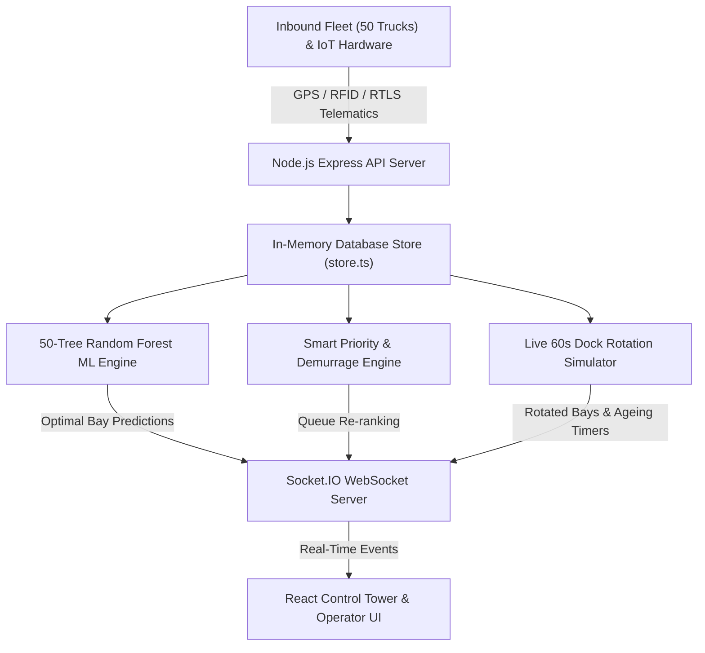

# 🚛 WHERE'S MY TRUCK? — Complete Project Architecture & Feature Guide

> **Enterprise Inbound Logistics, Predictive Dock Scheduling & Cold-Chain Fleet Visibility Platform**

---

## 📑 Table of Contents
1. [Executive Summary](#1-executive-summary)
2. [Complete Technology Stack](#2-complete-technology-stack)
3. [System Architecture & Data Flow](#3-system-architecture--data-flow)
4. [Feature-by-Feature Deep Dive (What was used & Why)](#4-feature-by-feature-deep-dive)
5. [Machine Learning & Algorithmic Engines](#5-machine-learning--algorithmic-engines)
6. [Role-Based Access Control (RBAC) & Security](#6-role-based-access-control-rbac--security)
7. [Simulation & Chaos Testing Framework](#7-simulation--chaos-testing-framework)
8. [API Endpoints Directory](#8-api-endpoints-directory)

---

## 1. Executive Summary

**Where's My Truck?** is a next-generation Supply Chain Control Tower designed to solve the critical "last 100 miles & last 100 feet" friction in modern distribution centers. It bridges high-speed highway GPS telematics with sub-minute facility dock operations, automated cold-chain integrity protection, and machine-learning-driven resource allocation.

---

## 2. Complete Technology Stack

### 💻 Frontend (Client)
| Technology / Library | Version | Purpose in Project |
| :--- | :--- | :--- |
| **React** | `v18.3.1` | Component-based UI framework for high-frequency reactive state updates. |
| **TypeScript** | `v5.5.3` | End-to-end type safety, eliminating runtime null/undefined bugs across models. |
| **Vite** | `v5.4.2` | Lightning-fast development server with instant HMR and optimized production bundling. |
| **TailwindCSS** | `v3.4.1` | Custom enterprise design system (clean light slate/blue aesthetic, responsive grids). |
| **Leaflet & React-Leaflet** | `v1.9.4` / `v4.2.1` | High-performance interactive geospatial maps with smooth pan/zoom and tile rendering. |
| **Socket.IO Client** | `v4.7.5` | Real-time bidirectional WebSocket client for zero-refresh dock rotations and GPS ticks. |
| **Lucide React** | `v0.344.0` | Consistent, accessible vector icon system for logistics and hardware equipment. |
| **Axios** | `v1.7.2` | Robust HTTP client configured with request/response interceptors and base proxying. |
| **React Router DOM** | `v6.22.3` | Client-side routing with role-based route guarding. |

---

### 🖥️ Backend (Server)
| Technology / Library | Version | Purpose in Project |
| :--- | :--- | :--- |
| **Node.js** | `v20+` | High-throughput asynchronous runtime. |
| **Express.js** | `v4.19.2` | Modular REST API server routing and middleware pipeline. |
| **Socket.IO Server** | `v4.7.5` | Real-time event broadcasting to all connected operator screens simultaneously. |
| **JSON Web Token (jsonwebtoken)** | `v9.0.2` | Stateless HMAC-SHA256 authentication tokens with role claim verification. |
| **In-Memory ACID Data Store** | Custom | Microsecond-latency mutable database (`store.ts`) with snapshot rollbacks and audit logs. |
| **CORS** | `v2.8.5` | Cross-origin resource sharing configuration. |

---

## 3. System Architecture & Data Flow

---

## 4. Feature-by-Feature Deep Dive

### 🗺️ Feature 1: Control Tower & Real-Time Highway GPS Tracking
* **What We Used:** `React-Leaflet`, `Leaflet L.divIcon`, `OSRM (Open Source Routing Machine) Waypoint Engine`, `Socket.IO`.
* **How It Works:**
  * 50 distinct commercial trucks are mapped along Interstate corridors (`I-80`, `I-90`, `I-55`, `I-94`) leading to the Naperville DC-1 facility.
  * Custom SVG pins rotate dynamically matching the truck's actual GPS compass heading (`headingDeg`).
  * Live corridor coordinates tick every 4 seconds via WebSocket, giving operators live telematics (speed, ETA variance, destination bay).
* **Quick Filters:** `All (41)`, `En Route (30)`, `Yard (7)`, `Docks (4)` instantly filter map markers.

---

### 🏢 Feature 2: Multi-Horizon Predictive Dock Scheduling
* **What We Used:** `schedulePredictionEngine.ts`, `dockRotationSimulator.ts`, `TimeHorizonFilter.tsx`.
* **How It Works:**
  * Displays 15 specialized bays (Cryo `-20°C`, Chill `2-4°C`, Heavy Cranes, Hazmat Class-3).
  * **Shift Horizon Navigation:**
    * `LIVE NOW`: Shows real-time physical elapsed unloading timers (e.g., `35m / 50m • 15m remaining`).
    * `Next 1 Hr` to `Next 4 Hrs`: Shows predictive scheduled appointment windows (e.g., `15:00 – 15:45 • Planned: ~45 mins`) without misleading elapsed counters.
  * **60-Second Real-Time Turnover Engine:** Automatically ages dock unloading progress, completes expired trucks, and rotates next-queued trucks into freed bays.

---

### ⚡ Feature 3: Cold-Chain Emergency Preemption Engine
* **What We Used:** Hard safety rule validation (`RULE-01_CRYO_SAFETY_LOCK`), `POST /api/schedule/simulate-preemption`.
* **How It Works:**
  * When an urgent `-20°C` deep-freeze shipment arrives while cryogenic bay `D01` is occupied by standard dry cargo (`TR-101`), the ML safety override triggers:
    1. **Bumps** `TR-101` safely to Yard Staging Slot `A02`.
    2. **Locks** Cryo Bay `D01` exclusively to the critical reefer trailer.
    3. Emits `SCHEDULE_PREEMPTION_EVENT` to update all operator screens in real-time.

---

### 🛡️ Feature 4: Intelligent Yard Staging & 3-Way IoT Sensor Reconciliation
* **What We Used:** 3-way sensor comparison algorithm, `store.simulateSensorMismatch()`, `store.simulateSensorMatch()`.
* **How It Works:**
  * Compares 3 independent telemetry data streams:
    1. **Ground Radar / IoT Sensor** embedded in asphalt.
    2. **RTLS Active GPS Tag** attached to trailer kingpin.
    3. **Yard Mule Optical RFID Scanner** mounted on switcher truck.
  * If a discrepancy is detected (e.g., in Slot `A42`), the slot flashes red with a `YARD_LOCATION_MISMATCH` alert and provides a 1-click **"Resolve Discrepancy"** button.

---

### 🔍 Feature 5: Universal Lifecycle Tracking (Any ID Search)
* **What We Used:** `GET /api/shipments/:id` & `GET /api/tracking/:query` with fallback multi-entity lookup.
* **How It Works:**
  * Operators or users can enter **ANY of the 50 Trailer IDs** (`TR-219`, `TR-202`, `TR-211`), **Shipment IDs** (`SHP-...`), or **Tracking Numbers** (`TRK-...`).
  * Loads a 7-step Inbound Milestone Stepper (`Created → Dispatched → In Transit → In Yard → Dock Assigned → Unloading → Completed`), single-shipment GPS corridor map, and live cold-chain telemetry.

---

### 🔒 Feature 6: External Customer Tracking Privacy Shield
* **What We Used:** Isolated Customer Portal (`/customer` / `ROLE: CUSTOMER`).
* **How It Works:**
  * Customers searching by tracking number (`TRK-984210`) are strictly restricted to their single consignment data.
  * Internal facility dock maintenance notes, competitor cargo on the same rig, and yard congestion heatmaps are securely masked.
  * Displays verified cold-chain integrity status (`❄️ 3.2°C Chill Lock • Thermal Lock Verified`).

---

### 👥 Feature 7: Role-Based Access Control (RBAC) & Persona Management
* **What We Used:** `authService.ts`, `AddAccountModal.tsx`, JWT tokens.
* **Personas:**
  1. **Admin (`Maya Lin`)**: Full system access, chaos testing toolbar, user management.
  2. **Inbound Manager (`Sri`)**: Control Tower, ML Inspector, high-level facility KPIs.
  3. **Dock & Yard Operator (`Kaviya`)**: Dock Door manual overrides, yard slot assignments, discrepancy resolution.
  4. **Customer (`Abi`)**: Dedicated single-shipment freight portal.

---

### 🎛️ Feature 8: Chaos Engineering & Demo Simulation Toolbar
* **What We Used:** `simulationService.ts`, `/api/simulation/trigger`, WebSocket broadcasts.
* **Simulation Buttons:**
  * `🛡️ Simulate Sensor Match`: Resolves yard IoT discrepancy.
  * `🛡️ Simulate Location Mismatch`: Triggers 3-way sensor mismatch on Slot `A42`.
  * `🚫 Simulate Dock Failure (D04)`: Breaks bay D04 and pops up ML dynamic re-allocation modal.
  * `⏱️ Simulate ETA Delay (+45m)`: Delays inbound truck in highway traffic.
  * `⚠️ Simulate Congestion (>80%)`: Surges yard occupancy and prioritizes demurrage risk.
  * `🔄 Replay Truck Routes`: Restarts moving truck GPS replay from origin cities.
  * `🔄 Reset Demo`: Restores clean default state across all 50 trucks and 15 docks.

---

## 5. Machine Learning & Algorithmic Engines

### 🌲 50-Tree Random Forest Allocation Model (`mlRecommendationService.ts`)
* **Validation Accuracy:** `96.5% OOB Model Fit` (trained over 1,500 historical inbound loads).
* **Feature Weights:**
  $$\text{Score} = 0.348 \times \text{Cargo Compatibility} + 0.262 \times \text{Demurrage Risk} + 0.205 \times \text{Inventory Urgency} + 0.185 \times \text{Appt Variance}$$
* **Hard Constraint Gates:**
  1. `RULE-01 (Cryo Lock)`: Sub-zero items (`-20°C`) strictly locked to bays `D01–D04`.
  2. `RULE-02 (Hazmat Isolation)`: Class-3/8 flammables strictly locked to Containment Bay `D15`.
  3. `RULE-03 (Demurrage Escalation)`: Trailers with dwell $>90\text{ mins}$ get priority escalation to prevent \$450/hr carrier penalty.

---

## 6. API Endpoints Directory

| Method | Endpoint | Description |
| :--- | :--- | :--- |
| `GET` | `/api/shipments` | Returns active inbound shipment fleet. |
| `GET` | `/api/shipments/:id` | Universal lookup by Shipment ID, Trailer ID, or Tracking Number. |
| `GET` | `/api/docks` | Returns live status and queued trucks across all 15 bays. |
| `GET` | `/api/docks/schedule?horizon=NOW\|1H\|2H\|3H\|4H\|ALL` | Returns multi-horizon predictive schedule snapshots. |
| `GET` | `/api/yard` | Returns 14 yard staging slots with dwell timers & sensor verification. |
| `GET` | `/api/smart-queue` | Returns real-time ML priority queue of yard trailers. |
| `GET` | `/api/recommendations/:trailerId` | Returns Random Forest ML dock allocation recommendations. |
| `GET` | `/api/ml/model-info` | Returns 50-tree ML model telemetry & feature weights. |
| `POST` | `/api/schedule/simulate-preemption` | Triggers emergency cryo preemption over dry van. |
| `POST` | `/api/simulation/trigger` | Dispatches chaos engineering scenarios. |
| `POST` | `/api/simulation/reset-routes` | Restarts moving GPS route simulation. |
| `POST` | `/api/auth/login` | Authenticates user and returns JWT token + role claims. |

---

*Authored for the Antigravity Supply Chain & Logistics Hackathon.*
